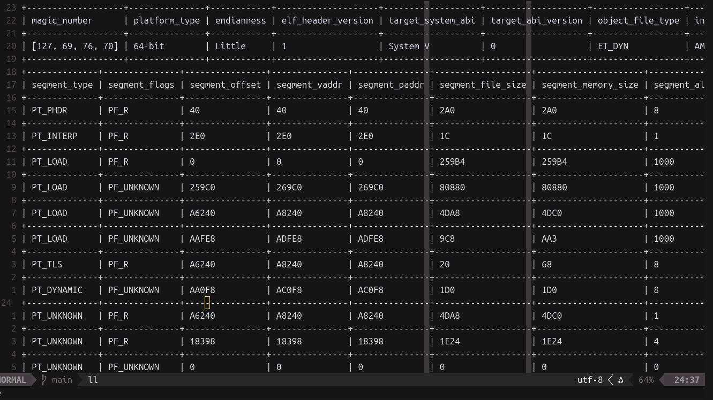

# elfp
An ELF binary file format parser

#

```bash
cargo build --release
./target/release/elfp --help
./target/release/elfp --filepath <path-to-elf-file>
./target/release/elfp -f <path-to-elf> [--header | --program | --section | --all]
```

Wish you luck!
[Licensing](LICENSE)
