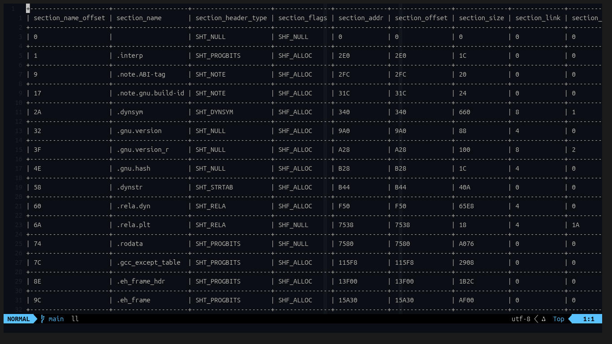

# elfp
An ELF binary file format parser

#

```bash
cargo build --release

elfp --help
elfp --filepath <path-to-elf-file> > dump
elfp -f <path-to-elf> [--header | --program | --section | --all] [--data] > dump
```

Wish you luck!
[Licensing](LICENSE)
